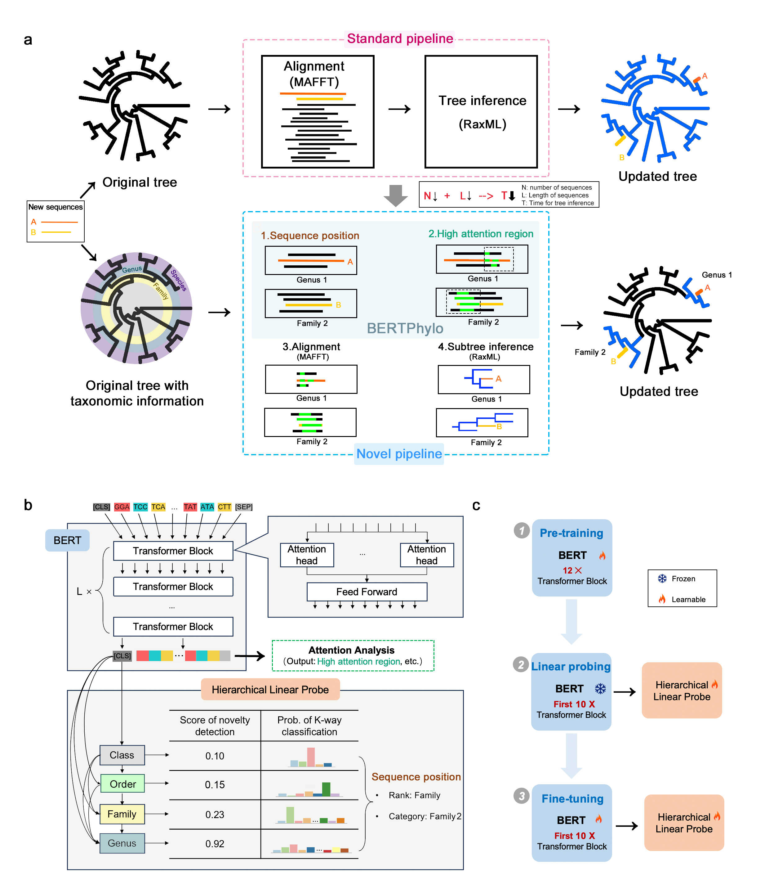

# BERTPhylo: An Efficient Method to accelerate Phylogenetic Inference using a Pretrained DNA Language Model

<!-- []() -->
[](https://github.com/danruod/BERTPhylo)
[](https://github.com/danruod/BERTPhylo/blob/main/LICENSE)
[](https://github.com/danruod/BERTPhylo/blob/main/DATA_LICENSE)


> **Authors**: Danruo Deng, Wuqin Xu*, Bian Wu, Hans Peter Comes, Yu Feng, Pan Li*, Jinfang Zheng*, Guangyong Chen*, and Pheng-Ann Heng.  
 **Affiliations**: CUHK, Zhejiang Lab, Zhejiang University, Salzburg Universit, Chengdu Institute of Biology (CAS).


Understanding the phylogenetic relationships among species is crucial for comprehending major evolutionary transitions, serving as the foundation for many biological studies. Despite the ever-growing volume of sequence data providing a significant opportunity for biological research, constructing reliable phylogenetic trees effectively becomes more challenging for current analytical methods. In this study, we introduce a novel solution to accelerate phylogeny inference using a pretrained DNA language model. Our approach identifies the taxonomic unit of a newly collected sequence using existing taxonomic classification systems and updates the corresponding subtree, akin to surgical corrections on a given phylogenetic tree. Specifically, we leverage a pretrained BERT network to obtain high-dimensional sequence representations, which are used not only to determine the subtree to be updated but also identify potentially valuable regions for subtree construction. We demonstrate the effectiveness of our method, named BERTPhylo, through experiments on our established PlantSeqs dataset, focusing on Embryophyta. Our findings provide the first evidence that phylogenetic trees can be constructed by automatically selecting the most informative regions of sequences, without manual selection of molecular markers. This discovery offers a robust guide for further research into the functional aspects of different regions of DNA sequences, enriching our understanding of biology.




# Requirement

Here [conda-pack](https://conda.github.io/conda-pack/) is used to create the conda environment archive, and the environment is packaged in 'phylo.tar.gz'.

  ```
  git clone --recursive https://github.com/danruod/BERTPhylo.git
  
  # Unpack environment into directory `my_env`
  mkdir -p my_env 
  tar -xzf phylo.tar.gz -C my_env
  conda activate phylo
  ```


# How to use it

  ```
  python eval.py  --model_name bertphylo --batch_size 64 --suffix test
  ```


# Contact
Feel free to contact me (Danruo DENG: [drdeng@link.cuhk.edu.hk](mailto:drdeng@link.cuhk.edu.hk)) if anything is unclear or you are interested in potential collaboration.

